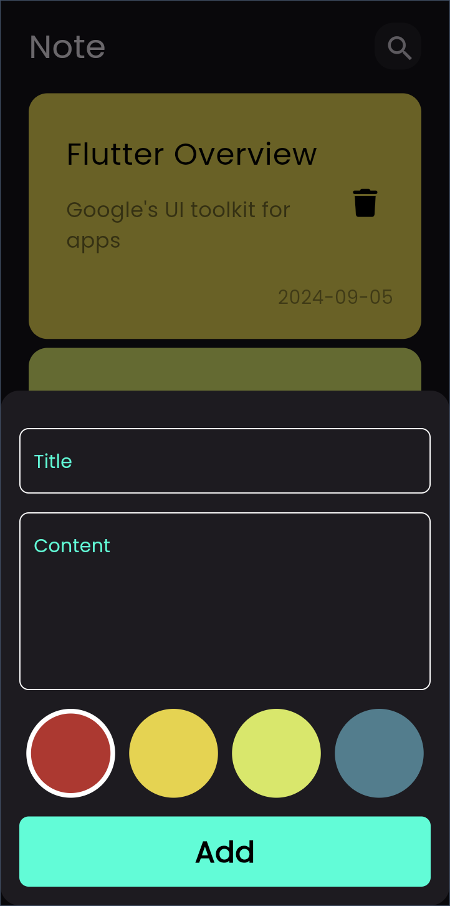
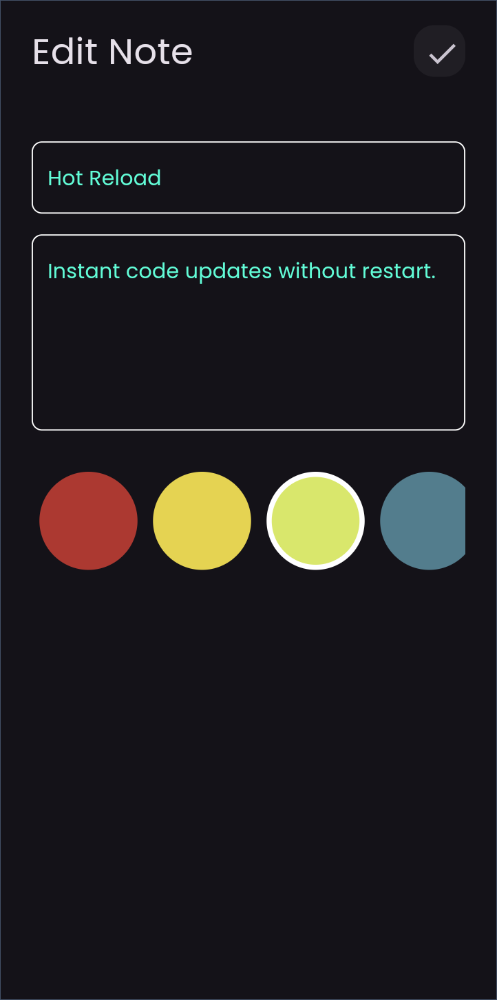

# 🗒️ Notes App

The **Notes App** is a mobile application designed to help users create, manage, and organize their notes efficiently. Developed as part of a training course, this app is intended for educational purposes and provides a clean and user-friendly interface for note-taking.

## ✨ Features

- **Responsive and Elegant Design**: Provides a seamless user experience across various devices.
- **Create Notes**: Easily create new notes with a title and content.
- **Edit Notes**: Update and modify existing notes as needed.
- **Delete Notes**: Remove notes you no longer need.

## 📸 Screenshots

<div style="display: flex; gap: 10px; justify-content: space-between;">
  
  
  
</div>

## 🛠️ Technologies Used

- **Flutter**: The primary framework used for building the app.
- **Dart**: The programming language employed for development.
- **State Management**: Utilizes reactive programming techniques for efficient state management.

## 📚 Learning Outcomes

Through this project, I have gained practical experience in:

- Structuring code into distinct layers to separate concerns.
- Applying state management techniques for building responsive and efficient UIs.
- Debugging and optimizing Flutter applications to improve performance.

## 📦 Packages Used

- **[flutter_bloc](https://pub.dev/packages/flutter_bloc)**: ^8.1.2
- **[hive_flutter](https://pub.dev/packages/hive_flutter)**: ^1.1.0
- **[font_awesome_flutter](https://pub.dev/packages/font_awesome_flutter)**: ^10.4.0
- **[modal_progress_hud_nsn](https://pub.dev/packages/modal_progress_hud_nsn)**: ^0.3.0

## 📚 Course Details

- **Course Name**: [Complete Flutter & Dart Development Course [Arabic]](https://www.udemy.com/course/best-and-complete-flutter-course-for-beginners/?couponCode=JUST4U02223)
- **Instructor**: [Tharwat Samy](https://www.udemy.com/user/tharwat-samy)
- **Certificate Issued To**: [Ayman Al-khatib](https://www.udemy.com/certificate/UC-15bb6cfc-d00c-4ad9-bbd9-5439a95a4bb8)

## 🚀 Getting Started

To get a local copy up and running, follow these steps:

### Prerequisites

- **Flutter SDK**: [Installation Guide](https://flutter.dev/docs/get-started/install)
- **Dart SDK**: Included with Flutter.
- **Code Editor**: Use VSCode, Android Studio, or any preferred code editor.

### Installation

1. Clone the repository:
   ```sh
   git clone https://github.com/Ayman-Al-Khatib/notes_app.git
2. Navigate into the project directory:
   ```sh
   cd notes_app
3. Install the dependencies:
   ```sh
   flutter pub get
4. Run the application:
   ```sh
   flutter run